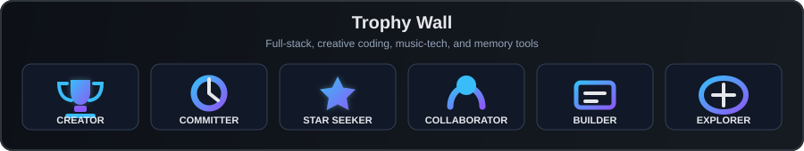

# Hi, I'm Haoran Fei 👋

Building small, expressive software where code, games, music and memory meet.

---

## 🧭 About Me

- 🎓 Electronic Information Science student exploring software, interaction and creative systems
- 💻 Building full-stack tools with **Vue**, **Vite**, **Netlify Functions**, **Supabase**, **FastAPI**, **Django** and **REST APIs**
- 🎮 Designing game-adjacent products for discovery, ratings, memories and personal archives
- 🎧 Experimenting with music-tech for chord timelines, guitar practice and playable theory
- 🪐 Creating visual interfaces with **Three.js**, motion, lighting and interaction
- 🧠 Interested in software that makes learning, memory and expression feel more tangible

---

## 🎯 Current Focus

<table>
<tr>
<td width="33%" valign="top">

### Shipping

- **GameMemory**: game discovery, Steam imports, ratings and memory sharing
- **String Blade**: guitar chord combat loops, timing feedback and playable browser polish
- **Portfolio**: a clearer front door for projects, demos and learning direction

</td>
<td width="33%" valign="top">

### Learning

- Production-ready Vue component architecture
- FastAPI audio pipelines with librosa, NumPy and SciPy
- Phaser structure, Web Audio input and Web MIDI interaction

</td>
<td width="33%" valign="top">

### Exploring

- Music theory as playable software
- Personal archives for game memories
- Creative tools shaped by practice, emotion and memory

</td>
</tr>
</table>

---

## 🛠️ Tech Stack

### Languages & Frameworks

### Creative, Data & Embedded

### Tools

---

## 🚀 Featured Projects

<table>
<tr>
<td width="50%" valign="top">

### 🎮 GameMemory

A full-stack personal game archive for searching, importing, rating, tagging, reviewing and sharing game memories.

Built with Vue 3, Vite, Netlify Functions, Supabase, RAWG API, Steam Web API and SteamGridDB.

**Current direction:** polishing the core collection flow, Steam-powered imports and memory-first review experience.

> Recording not only what I played, but also how each game felt.

</td>
<td width="50%" valign="top">

### 🎸 String Blade

A browser-based guitar chord combat game where chord input becomes attacks, guards, parries and rhythm actions.

Built with Vite, TypeScript, Phaser, Web Audio API and Web MIDI.

**Current direction:** improving chord readability, input feedback and a tighter playable loop.

> Turning music practice into a readable, reactive game loop.

</td>
</tr>
<tr>
<td width="50%" valign="top">

### 🎧 ChordPilot

A local music-tech Web app that analyzes uploaded audio and generates a synchronized chord timeline.

Built with Vue 3, Vite, PrimeVue, FastAPI, librosa, NumPy, SciPy and optional Demucs separation.

**Current direction:** making audio analysis results easier to inspect, adjust and export.

> Helping a song become something visible, navigable and learnable.

</td>
<td width="50%" valign="top">

### 🧩 Haoran Fei Portfolio

A personal portfolio site for presenting projects, learning direction and creative software work.

Built as a polished front door for recent full-stack, music-tech and game projects.

**Current direction:** keeping demos, project stories and learning notes aligned with what I am actually shipping.

> A clearer map of what I am building and why.

</td>
</tr>
</table>

---

## 🧪 Creative Labs

Smaller experiments that feed the bigger projects.

<table>
<tr>
<td width="33%" valign="top">

### 🪐 Particle Saturn

Interactive Three.js particle scenes with orbital motion, lighting and real-time visual transitions.

</td>
<td width="33%" valign="top">

### 🎼 Fretboard CAGED Lab

A guitar-learning interface for exploring CAGED shapes, fretboard notes and visual music theory.

</td>
<td width="33%" valign="top">

### 🎣 Smart Fishing Alert

An STM32-based fishing bite detection and alert project, connecting embedded sensing with practical interaction.

</td>
</tr>
</table>

---

## 📌 2026 Roadmap

- Ship **GameMemory v1** with stronger Steam imports, notes, ratings and sharing flows
- Release a more readable **String Blade** demo with chord input, timing feedback and clear combat rules
- Polish **ChordPilot** into a smoother audio-to-chord-timeline workflow
- Keep improving the portfolio as a front door for full-stack, game and music-tech work
- Build small music-learning interfaces that make theory feel visible and playable

---

## 🧭 How I Build

<table>
<tr>
<td width="33%" valign="top">

### Start Small

Turn one clear idea into a working prototype, then let real use expose what matters.

</td>
<td width="33%" valign="top">

### Make It Feelable

Use visuals, motion, sound and interaction to make abstract systems easier to understand.

</td>
<td width="33%" valign="top">

### Ship Often

Prefer finished small tools over perfect unfinished plans, then polish from feedback.

</td>
</tr>
</table>

---

## 📊 GitHub Stats

  
  

 

  

---

## 🏆 GitHub Trophies

---

## 📊 GitHub Activity

---

## 🐍 Contribution Snake

<picture>
  <source media="(prefers-color-scheme: dark)" srcset="https://raw.githubusercontent.com/1379475267-svg/1379475267-svg/output/github-contribution-grid-snake-dark.svg" />
  <source media="(prefers-color-scheme: light)" srcset="https://raw.githubusercontent.com/1379475267-svg/1379475267-svg/output/github-contribution-grid-snake.svg" />
  
</picture>

---

## 🌙 Creative Thread

> Code for logic.  
> Music for emotion.  
> Projects for memory.

> “Code is not only logic. It is also a way to remember, express, and build gently.”

---

## 🔗 Socials

---

