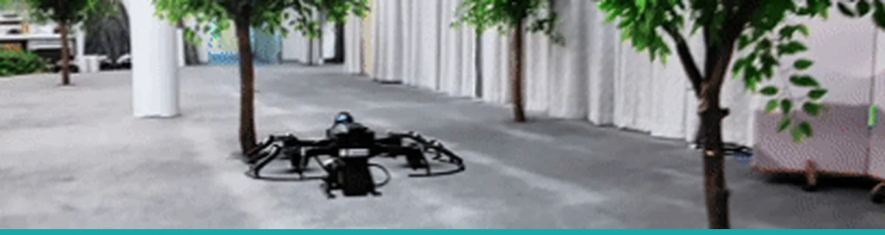

  
   
  Indoor navigation demo from the Nonconvex-α educational research drone project.

<h1 align="center">Haoran Fei</h1>

  <strong>Electronic Information Science student building autonomous systems, embedded devices, and creative software.</strong>
   
  ROS 1 / PX4 / STM32 / TypeScript / Vue / FastAPI / Web Audio

  <a href="https://1379475267-svg.github.io/haoran-fei-portfolio/"><strong>Portfolio - Global</strong></a>
  &nbsp;/&nbsp;
  <a href="https://fhrzz.me/"><strong>Portfolio - China</strong></a>
  &nbsp;/&nbsp;
  <a href="mailto:1379475267@qq.com">Email</a>
  &nbsp;/&nbsp;
  <a href="https://space.bilibili.com/19876581">Bilibili</a>

## Current mission

I am working with a student team on the secondary development of a **Nonconvex-α educational research drone**. My current learning path follows the complete autonomy loop:

`Sense -> Localize -> Plan -> Validate`

- Preserve a recoverable source and configuration baseline before changing hardware-facing systems.
- Connect Livox Mid-360 sensing, Faster-LIO localization, local planning, and PX4 flight control into one understandable workflow.
- Move each change from static checks and simulation to propeller-off tests and controlled flight validation.

Alongside the drone work, I build full-stack and music-technology products that turn complex systems into usable, interactive tools.

## Selected work

| Project | What it demonstrates | Live |
| --- | --- | --- |
| [Nonconvex-α Standard Drone](https://github.com/1379475267-svg/nonconvex-alpha-standard) | A recoverable team source snapshot and workflow for secondary development of an educational research drone. ROS 1 / PX4 / C++ / Livox / Faster-LIO | Repository |
| [GameMemory](https://github.com/1379475267-svg/GameMemory) | A personal game archive with Steam import, ratings, tags, reviews, and a local-data fallback. Vue / Supabase / Netlify Functions | [Global](https://1gamememory1.netlify.app) / [China](https://fhrzz.me/projects/gamememory/) |
| [String Blade](https://github.com/1379475267-svg/String-Blade) | A guitar-chord combat game supporting microphone, MIDI, and manual chord input. TypeScript / Phaser / Web Audio / Web MIDI | [Global](https://stringblade.netlify.app) / [China](https://fhrzz.me/projects/string-blade/) |
| [ChordPilot](https://github.com/1379475267-svg/ChordPilot) | An audio-analysis app that turns uploaded music into a synchronized chord timeline. Vue / FastAPI / librosa | [China](https://fhrzz.me/projects/chordpilot/) |

More experiments: [Fret & Key Theory Lab](https://github.com/1379475267-svg/fretboard-caged-lab) ([Global](https://1379475267-svg.github.io/fretboard-caged-lab/) / [China](https://fhrzz.me/projects/fretboard/)) / [Interactive Particle Saturn](https://github.com/1379475267-svg/interactive-particle-saturn) ([Global](https://1379475267-svg.github.io/interactive-particle-saturn/)) / [All repositories](https://github.com/1379475267-svg?tab=repositories)

## Capability map

| Focus | Working stack | Evidence |
| --- | --- | --- |
| Autonomous systems | ROS 1, PX4, MAVROS, Livox, Faster-LIO, C++ | [Drone source, configuration, and team workflow](https://github.com/1379475267-svg/nonconvex-alpha-standard) |
| Product engineering | TypeScript, Vue, Vite, FastAPI, Supabase | [GameMemory](https://github.com/1379475267-svg/GameMemory) and [ChordPilot](https://github.com/1379475267-svg/ChordPilot) |
| Interactive systems | Phaser, Three.js, Web Audio, Web MIDI, librosa | [String Blade](https://github.com/1379475267-svg/String-Blade), [ChordPilot](https://github.com/1379475267-svg/ChordPilot), and [Particle Saturn](https://github.com/1379475267-svg/interactive-particle-saturn) |
| Embedded foundations (currently learning) | C, STM32, sensor input and alert output | [Smart Fishing Alert](https://github.com/1379475267-svg/smart-fishing-alert), an early-stage learning project |

## Engineering approach

- **Preserve the baseline.** Keep original code, configuration, and known-good behavior recoverable.
- **Test in layers.** Verify assumptions through static checks, simulation, hardware-safe tests, and controlled real-world trials.
- **Document the evidence.** Record what changed, why it changed, and what proved the result.
- **Ship understandable systems.** Prefer working, inspectable tools over opaque demos.

  <em>Build carefully, learn openly, and keep useful experiments reproducible.</em>

