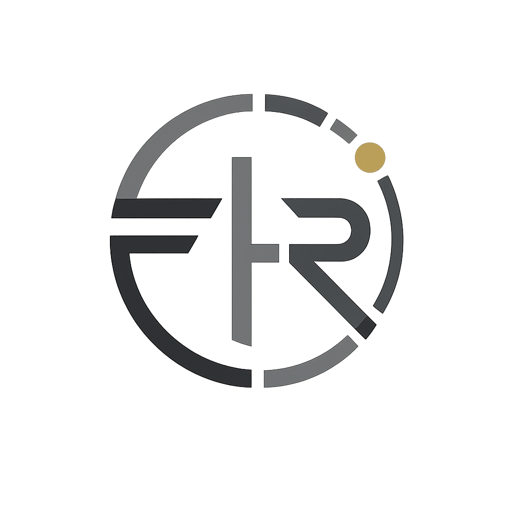
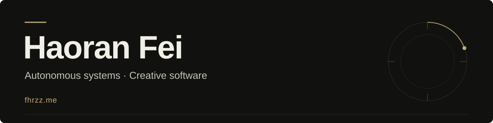
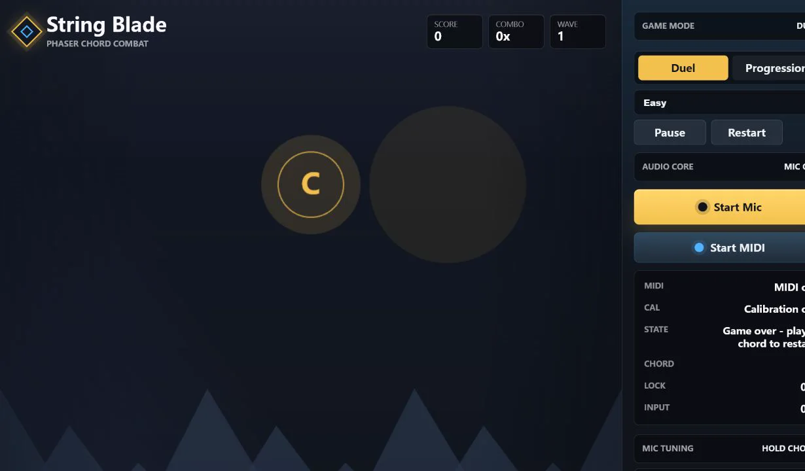

**Electronic Information Science student building autonomous systems, embedded devices, and creative software.**

ROS · PX4 · STM32 · Rust · Tauri · TypeScript · Vue · FastAPI · Web Audio

[Portfolio](https://fhrzz.me/) · [Gmail](mailto:fei1379475267@gmail.com) · [QQ Email](mailto:1379475267@qq.com) · [Bilibili](https://space.bilibili.com/19876581)

## Selected work

<table>
  <tr>
    <td width="50%">
      
       <strong>RailDrone Mission Studio</strong> Mission planning and robot–drone coordination. Browser software prototype
    </td>
    <td width="50%">
      
       <strong>String Blade</strong> Guitar chords become game controls. Curated by <a href="https://dead.army/games/string-blade-c8627c">DEAD.ARMY</a>
    </td>
  </tr>
</table>

- **[Nonconvex-α Standard Drone](https://github.com/1379475267-svg/nonconvex-alpha-standard)** — A recoverable team source snapshot and workflow for secondary development of an educational research drone. ROS 1 · PX4 · C++ · Livox · Faster-LIO

- **[RailDrone Mission Studio](https://github.com/1379475267-svg/rail-drone-mission-studio)** — Mission planning, contact-wire review, and robot–drone coordination in a runnable browser prototype. No real hardware connection. Vue 3 · TypeScript · Pinia · SVG / Canvas · [Try it](https://fhrzz.me/projects/rail-drone-mission-studio/) / [Global](https://1379475267-svg.github.io/rail-drone-mission-studio/)

- **[String Blade](https://github.com/1379475267-svg/String-Blade)** — A guitar-chord combat game supporting microphone, MIDI, and manual chord input. TypeScript · Phaser · Web Audio · Web MIDI · [Play](https://fhrzz.me/projects/string-blade/) / [Global](https://stringblade.netlify.app)

- **[DocPilot](https://fhrzz.me/docpilot/)** — A Windows document organizer with editable naming suggestions, previews before changes, and an undo option for the latest operation. Tauri · Rust · Vue 3 · SQLite · Windows v0.1 · [Overview & download](https://fhrzz.me/docpilot/)

- **[GameMemory](https://github.com/1379475267-svg/GameMemory)** — A personal game archive with Steam import, ratings, tags, reviews, and a local-data fallback. Vue · Supabase · Netlify Functions · [Try it](https://fhrzz.me/projects/gamememory/) / [Global](https://1gamememory1.netlify.app)

- **[DeadTime](https://github.com/1379475267-svg/DeadTime)** — A Windows desktop beta that reads League of Legends' documented local player API and switches to an existing entertainment window after a confirmed death. Python · PySide6 · Windows API · pytest · [Overview & download](https://fhrzz.me/deadtime/)

- **[ChordPilot](https://github.com/1379475267-svg/ChordPilot)** — An audio-analysis app that turns uploaded music into a synchronized chord timeline. Vue · FastAPI · librosa · [Try it](https://fhrzz.me/projects/chordpilot/)

More experiments: [Fret & Key Theory Lab](https://github.com/1379475267-svg/fretboard-caged-lab) · [Interactive Particle Saturn](https://github.com/1379475267-svg/interactive-particle-saturn) · [All repositories](https://github.com/1379475267-svg?tab=repositories)

## Current mission

I am working with a student team on the secondary development of a **Nonconvex-α educational research drone**. My current learning path follows the autonomy loop:

`Sense → Localize → Plan → Validate`

- Preserve a recoverable source and configuration baseline before changing hardware-facing systems.
- Connect Livox Mid-360 sensing, Faster-LIO localization, local planning, and PX4 flight control into one understandable workflow.
- Move each change from static checks and simulation to propeller-off tests and controlled flight validation.

Alongside the drone work, I build desktop, web, and music-technology products that turn complex systems into usable tools.

## Capability map

| Focus & evidence | Tools |
| --- | --- |
| **Autonomous systems** [Nonconvex-α](https://github.com/1379475267-svg/nonconvex-alpha-standard) | ROS 1 · PX4 · MAVROS · Livox Mid-360 · Faster-LIO · C++ · Linux |
| **Desktop applications** [DocPilot](https://fhrzz.me/docpilot/) · [DeadTime](https://github.com/1379475267-svg/DeadTime) | Rust · Tauri · Vue 3 · SQLite · Python · PySide6 · Windows API |
| **Product engineering** [RailDrone](https://github.com/1379475267-svg/rail-drone-mission-studio) · [GameMemory](https://github.com/1379475267-svg/GameMemory) | TypeScript · Vue · Vite · Pinia · FastAPI · Supabase · PostgreSQL |
| **Interactive systems** [String Blade](https://github.com/1379475267-svg/String-Blade) · [ChordPilot](https://github.com/1379475267-svg/ChordPilot) · [Particle Saturn](https://github.com/1379475267-svg/interactive-particle-saturn) | Phaser · Three.js · Web Audio · Web MIDI · librosa |
| **Embedded foundations** Currently learning · [Smart Fishing Alert](https://github.com/1379475267-svg/smart-fishing-alert) | C · C++ · STM32 · sensor input · alert output |

## Engineering approach

- **Preserve the baseline.** Keep original code, configuration, and known-good behavior recoverable.
- **Test in layers.** Verify assumptions through static checks, simulation, hardware-safe tests, and controlled real-world trials.
- **Document the evidence.** Record what changed, why it changed, and what proved the result.
- **Ship understandable systems.** Build working tools whose behavior can be inspected and explained.

<em>Build carefully, learn openly, and keep useful experiments reproducible.</em>

<a href="https://fhrzz.me/">fhrzz.me</a> · <a href="https://1379475267-svg.github.io/haoran-fei-portfolio/">GitHub Pages mirror</a>

